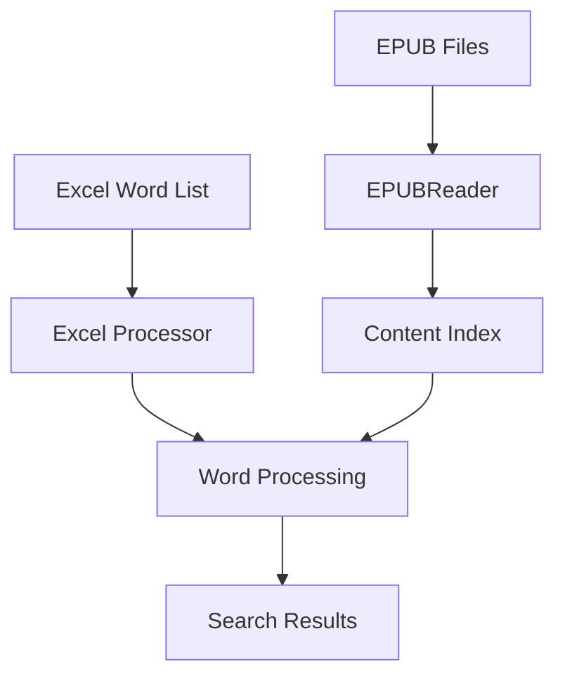
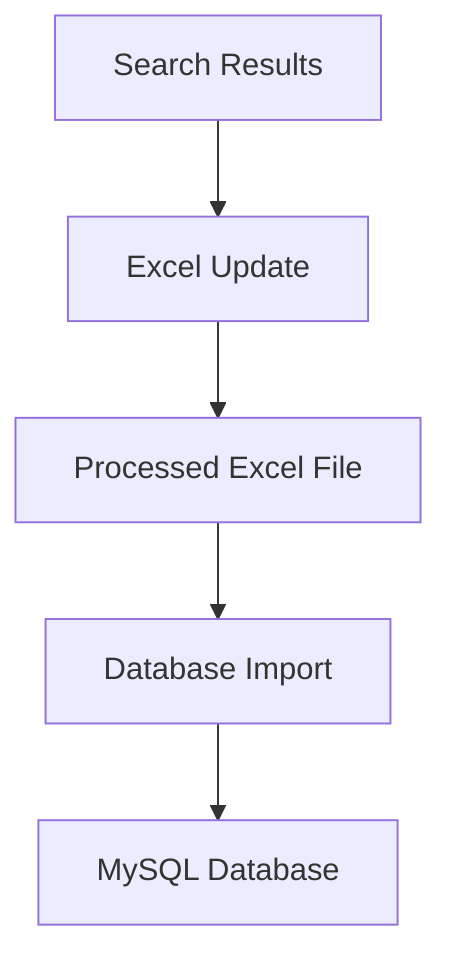

# System Architecture and Technical Overview

## System Components

### 1. EPUB Processing Layer
- **Component**: EPUBReader
- **Location**: `src/epub/epub_reader.py`
- **Responsibilities**:
  - EPUB file parsing and content extraction
  - Text content indexing and storage
  - Word search functionality
  - Context extraction

### 2. Data Processing Layer
- **Component**: Excel Processor
- **Location**: `src/excel/process_excel.py`
- **Responsibilities**:
  - Excel file reading and parsing
  - Word list management
  - Search result integration
  - Output file generation

### 3. Database Layer
- **Component**: Database Operations
- **Location**: `src/db/excel_to_mysql.py`, `src/db/verify_mysql.py`
- **Responsibilities**:
  - Database connection management
  - Schema creation and management
  - Data insertion and verification
  - Error handling and retry logic

## Data Flow

### 1. Input Processing


### 2. Data Integration


## File Structure

### Data Directory
```
data/
├── epub/     # EPUB book files
└── excel/    # Excel input/output files
```

### Source Code
```
src/
├── epub/     # EPUB processing
├── excel/    # Excel operations
└── db/       # Database operations
```

### Documentation
```
doc/
├── epub_reader.md
├── excel_processor.md
├── database_operations.md
└── system_architecture.md
```

## Processing Pipeline

### 1. Initialization Phase
1. Load EPUB files
2. Create content indices
3. Load Excel word list
4. Prepare database connection

### 2. Processing Phase
1. Word extraction from Excel
2. Search execution in EPUB files
3. Result collection and formatting
4. Excel file update

### 3. Storage Phase
1. Database schema creation
2. Data transformation
3. Batch insertion
4. Verification and validation

## Error Handling Strategy

### 1. File Operations
- File existence verification
- Format validation
- Permission checking
- Resource cleanup

### 2. Data Processing
- Input validation
- Type conversion safety
- Memory management
- Progress tracking

### 3. Database Operations
- Connection retry mechanism
- Transaction management
- Duplicate handling
- Error logging

## Performance Considerations

### 1. Memory Management
- Efficient data structures
- Batch processing
- Resource optimization
- Cache utilization

### 2. Processing Efficiency
- Early exit conditions
- Optimized search algorithms
- Progress reporting
- Resource pooling

### 3. Database Optimization
- Connection pooling
- Index utilization
- Batch operations
- Query optimization

## Security Measures

### 1. Data Protection
- Input sanitization
- Error message security
- Resource isolation
- Access control

### 2. Database Security
- Connection encryption
- Credential management
- Query parameterization
- Access restrictions

## Scalability Considerations

### 1. Current Limitations
- Single-threaded processing
- Memory constraints
- Sequential operations
- Fixed retry strategy

### 2. Potential Improvements
- Parallel processing
- Distributed search
- Connection pooling
- Caching mechanisms

## Monitoring and Maintenance

### 1. Progress Tracking
- Operation status
- Completion percentage
- Error reporting
- Performance metrics

### 2. Data Verification
- Result validation
- Data integrity
- Error detection
- Quality assurance

## Integration Points

### 1. File System
- EPUB file access
- Excel file operations
- Directory management
- Resource handling

### 2. Database System
- Connection management
- Schema evolution
- Data persistence
- Query execution

## Future Enhancements

### 1. Performance Optimization
- Multi-threading support
- Improved search algorithms
- Memory optimization
- Caching implementation

### 2. Feature Additions
- Advanced search options
- Result filtering
- Data analytics
- Reporting tools